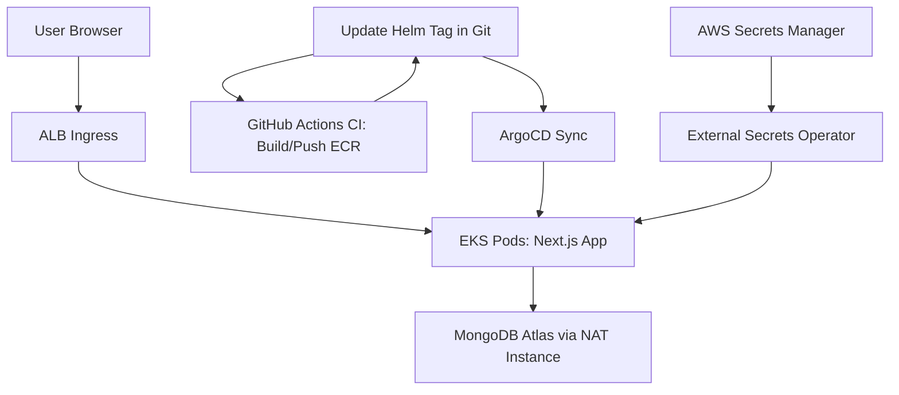

# FinTrack Platform: Cloud-Native Finance Tracker on AWS EKS

[](https://www.terraform.io/) [](https://kubernetes.io/) [](https://argoproj.github.io/cd/) [](https://opensource.org/licenses/MIT)

## Project Description
FinTrack is a lightweight financial tracking app built with Next.js + Node.js, deployed on AWS EKS using Terraform IaC, ArgoCD GitOps, and Helm. It's stateless, connects to MongoDB Atlas, and is designed for learning cloud-native architecture.

This repo is my portfolio project to demonstrate:
- Infrastructure as Code (Terraform modules for VPC, EKS, IAM)
- GitOps deployments (ArgoCD auto-sync from Git)
- CI/CD (GitHub Actions with scans)
- Security (IRSA, External Secrets, NetworkPolicies)
- Monitoring (Prometheus/Grafana)
- Cost optimization (Free-tier AWS in eu-west-1, NAT instance)

## Tech Stack
- App: Next.js, Node.js, Docker
- Infra: AWS (VPC, EKS, ECR, Secrets Manager) in eu-west-1
- IaC: Terraform (modular, environments)
- GitOps: ArgoCD + Helm
- DB: MongoDB Atlas (free M0)
- CI/CD: GitHub Actions
- Monitoring: Prometheus, Grafana, Fluent Bit

## Architecture Diagram


## Quick Start (Local Dev)

```bash
docker-compose up
```
Open http://localhost:3000

## AWS Setup Guide
See `docs/how-to/aws-setup.md` for full steps. (We'll add this file later.)

## Learning Journey
See commit history for progression: Started with Next.js app, switched to Atlas, now building infra/GitOps.

## Contributing
Use conventional commits. See `CONTRIBUTING.md`. (We'll add this later.)

## Built by
Mohamed Mechraoui for portfolio/learning.
