# Cloud Native EKS Platform Architecture

This document outlines the high-level architecture of the Cloud Native EKS Platform.

## Architecture Diagram

```mermaid
graph TD
    subgraph "User Access"
        A[👤 User Browser]
    end

    subgraph "AWS Cloud — eu-north-1"
        subgraph "VPC: 10.0.0.0/16"
            subgraph "Public Subnets"
                B[ALB Ingress Controller]
                NAT[🖥️ NAT Instance<br/>t4g.micro + EIP]
                IGW[Internet Gateway]
            end

            subgraph "Private Subnets"
                subgraph "EKS Cluster"
                    C[📦 FinTrack Pods<br/>Next.js App]
                    ESO[🔐 External Secrets<br/>Operator]
                    ARGO[🔄 ArgoCD]
                    PROM[📊 Prometheus]
                    GRAF[📈 Grafana]
                    FB[📋 Fluent Bit<br/>DaemonSet]
                    KYV[🛡️ Kyverno]
                end
            end
        end

        ECR[📦 ECR Registry]
        SM[🔑 AWS Secrets Manager]
        CW[☁️ CloudWatch Logs]
    end

    subgraph "External Services"
        ATLAS[🍃 MongoDB Atlas<br/>M0 Free Tier]
        GH[🐙 GitHub Repo]
    end

    A -->|HTTPS| B
    B --> C
    C -->|MONGODB_URI| ATLAS
    NAT -->|Outbound| IGW
    C -.->|via NAT| NAT

    GH -->|Push| GHA[⚙️ GitHub Actions<br/>Build/Scan/Push]
    GHA -->|Push Image| ECR
    GHA -->|Update Helm Tag| GH
    GH -->|Auto-Sync| ARGO
    ARGO -->|Deploy| C

    SM --> ESO
    ESO -->|Inject Secrets| C

    PROM -->|Scrape Metrics| C
    GRAF -->|Visualize| PROM
    FB -->|Ship Logs| CW
    KYV -->|Enforce Policies| C
```

## Key Components

### Compute & Networking
- **EKS Cluster**: Managed Kubernetes service running the application workloads in private subnets.
- **NAT Instance**: Cost-effective alternative to NAT Gateway for outbound internet access from private subnets (e.g., pulling images, connecting to Atlas).
- **ALB Ingress Controller**: Manages Application Load Balancers for external access to services.

### Data & State
- **MongoDB Atlas**: Managed database service (external to AWS VPC).
- **External Secrets Operator**: Syncs secrets from AWS Secrets Manager into Kubernetes Secrets.

### Observability & Security
- **Prometheus & Grafana**: Metrics collection and visualization.
- **Fluent Bit & CloudWatch**: Log aggregation.
- **Kyverno**: Policy enforcement engine (e.g., requiring labels, disallowing privileged containers).
